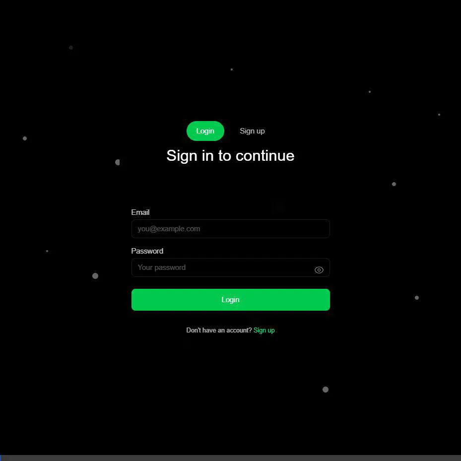

# PARP: Public AI Readiness Platform (Kenya)

**Winner: Best AI for Public Service Innovation (Thesis Prototype)**

PARP is a comprehensive digital dashboard designed to help Kenyan public sector organizations adopt AI. It combines self-assessment tools, real-time analytics, AI-powered service agents, and automated benchmarking to bridge the digital divide.

## 🚀 Key Features

### 1. **TOE Assessment Engine**
- Evaluates readiness across **Technology, Organization, and Environment** pillars.
- Provides immediate scoring and tailored recommendations.
- Saves progress for longitudinal tracking.

### 🎥 End-to-End Platform Demo


### 2. **AI Service Desk**
- **Smart Agents**: Context-aware AI assistants for Healthcare (SHA), Transport (NTSA), Education (HELB), and Gig Work (Ajira).
- **Direct Integration**: Guides users to official government portals (e.g., `sha.go.ke`) with actionable advice.

### 3. **Organization Pulse Check**
- **AI Analyst**: Enter any organization name (e.g., "KRA") to receive an instant, AI-generated maturity assessment.
- **Insights**: Provides SWOT analysis and ethical use disclaimers.

### 4. **Real-Time Intelligence Hub**
- **News Feed**: Live aggregator of "AI & Technology in Kenya" news using Google RSS.
- **Benchmarking**: Compares user scores against national averages (e.g., 42.1% adoption) with visual progress tracking.
- **Market Stats**: Live policy updates and adoption metrics via Supabase Realtime.

### 5. **Multilingual AI Chat**
- **Code-Switching**: AI understands and responds in English, Kiswahili, and Sheng.
- **Ethical Guardrails**: Built-in bias checking and refusal to generate harmful content.
- **Local Context**: Trained on Kenya Data Protection Act (ODPC) and ICT Master Plan.
- **Predictive Analytics [NEW]**: Provides dynamic wait-time estimations and data projections.
- **Personalized Context [NEW]**: Responses automatically adapt to user roles and County/Locations.
- **Feedback Loop**: Integrated capability to accurately parse mock complaint/report scenarios.

## 🛠️ Tech Stack

- **Frontend**: Next.js 14, Tailwind CSS, Framer Motion
- **Backend**: Supabase (PostgreSQL, Auth, Edge Functions)
- **AI/LLM**: OpenAI GPT-4o (Analysis), Ollama (Local Fallback), Web Speech API (TTS)
- **Realtime**: Supabase Realtime Channels
- **Deployment**: Vercel (Web), Electron (Desktop Prototype)

## 📦 Setup & Installation

1.  **Clone the Repository**
    ```bash
    git clone https://github.com/yourusername/parp-kenya.git
    cd parp-kenya
    ```

2.  **Install Dependencies**
    ```bash
    npm install
    # Install platform-specific binaries if needed
    ```

3.  **Environment Variables**
    Create a `.env.local` file:
    ```env
    NEXT_PUBLIC_SUPABASE_URL=your_supabase_url
    NEXT_PUBLIC_SUPABASE_ANON_KEY=your_supabase_anon_key
    OPENAI_API_KEY=your_openai_key
    ```

4.  **Run Development Server**
    ```bash
    npm run dev
    ```
    Visit `http://localhost:3000`.

## 📱 Mobile & PWA

- PARP is fully responsive.
- Includes a PWA Manifest for "Add to Home Screen" installation.
- Works offline with cached app shell.

### Mobile QA Checklist

Use this quick checklist before releasing UI changes:

- No horizontal page scroll on key routes: `/`, `/login`, `/signup`, `/privacy`, `/reset-password`, `/dashboard`, `/assess`, `/chat`, `/profile`.
- Hero cards and action buttons stack correctly on small screens (320px to 430px widths).
- Drawers, modals, and dropdowns stay within viewport width.
- Status badges/chips wrap gracefully instead of forcing overflow.
- Images, videos, and embedded content scale to container width.
- Bottom navigation does not cover primary actions and forms.

### Automated Responsive Regression Test

Run the viewport overflow regression suite:

```bash
npm run test:responsive
```

Run in interactive UI mode:

```bash
npm run test:responsive:ui
```

## ⚠️ Ethical Disclaimer

This tool uses AI to estimate organizational maturity based on public data. It does not access private internal systems. All assessments should be verified by human auditors.

---
*Built for the Master of Science in Data Science Thesis, 2026/2027.*
